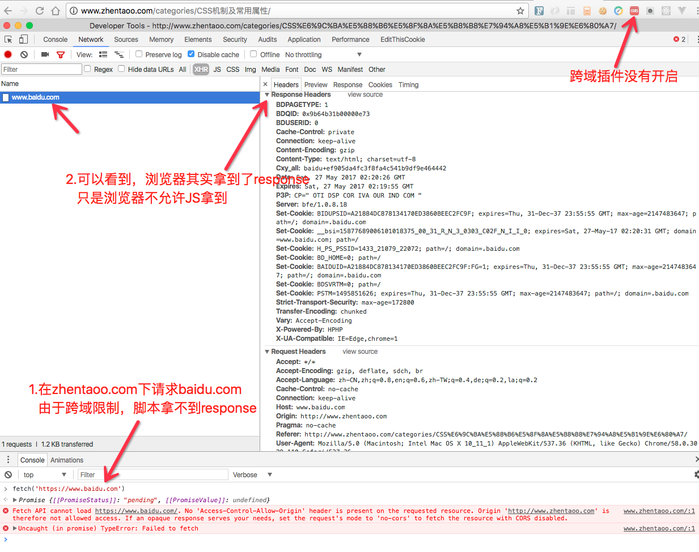

近期出于工作原因，又折腾了跨域问题，nginx的配置变的生疏了，这次在这里做个总结...

#### 跨域问题如何产生的？
跨域限制是浏览器特有的行为，出于安全考虑，浏览器不允许脚本获取其他域下资源。
同域需要同时满足以下3点
1. 协议: https和http属于不同协议，会产生跨域问题
2. 域名: 比如www.baidu.com与www.taobao.com; aaa.baidu.com与bbb.baidu.com 子域也都属于跨域
3. 端口: 8080、80不同端口号，当然也会产生跨域问题

#### 服务器间通信存在跨域吗？
不存在！跨域限制是浏览器行为，是浏览器为了保护用户隐私的一种策略，服务器是没有这个限制的。
即使存在跨域问题，在浏览器的network中也是可以看到http response的。
只是浏览器限制脚本去获取response内容。

1.正常情况下，没有开启跨域插件，fetch其他域的资源，可以看到报错，脚本无法获取response


2.开启跨域插件，fetch其他域的资源，开启之后插件会对http req res做些修改，欺骗浏览器，脚本可以拿到response


#### 如何解决跨域问题？
1. 跨域问题与服务器没有直接关系，但是想要跨域成功，仍然需要服务端做一些配合，也就是response header里面加一些字段
```bash
location / {
  // 允许哪个域名来访问资源
  add_header 'Access-Control-Allow-Origin' "*";

  // 请求的返回内容里包含cookies
  add_header 'Access-Control-Allow-Credentials' 'true';

  // 允许请求的method
  add_header 'Access-Control-Allow-Methods' 'GET, POST, OPTIONS';

  add_header 'Access-Control-Allow-Headers' 'DNT,X-CustomHeader,Keep-Alive,User-Agent,X-Requested-With,If-Modified-Since,Cache-Control,Content-Type';
}

```

2. 使用服务器做转发，也就是脚本在本域下发起请求，由服务器做转发，这样就不会有跨域问题，以下是nginx配置
``` bash
location /api/baidu {
  proxy_pass https://www.baidu.com;  
  proxy_redirect off;
  proxy_set_header Host $host;
  proxy_set_header X-Real-IP $remote_addr;
}
```

3. jsonp方式
其实不难发现，我们的img标签经常会使用其他域下的图片资源，但是浏览器没有做限制。
所以之前也会有利用 src 属性做跨域请求的手段出现，但限制是只能是get请求，hack成份比较多，不推荐。
