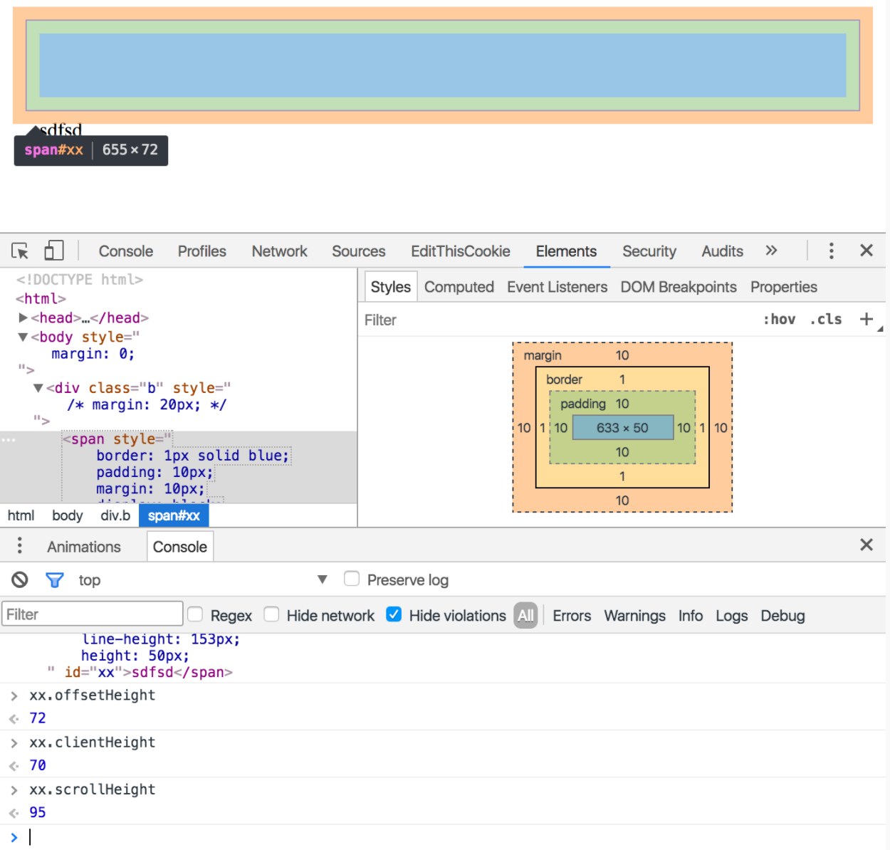

html中所有元素都可以看作“盒子”

### 正常盒模型

  - #### BLOCK:块级元素
  1. block元素会独占一行，默认宽度自动填满其父元素宽度
  1. 包括：内容(content)、填充(padding)、边框(border)、边界(margin)。
  1. 总宽度/高度 = width/height + padding + border + margin

  - #### INLINE:行内元素
  1. 行内元素：一行排满才会换行，宽度随元素内容多少变化
  1. inline元素属性：line-height设置高度，width、height无效，只有**水平方向的margin、padding**边距有效果,垂直方向的margin padding无效。

### 怪异模式盒模型
  - #### BLOCK:块级元素
  1. 盒子的总宽度和高度是包含内边距padding和边框border宽度在内的
  1. 总宽度/高度= width/height + margin = 内容区宽度/高度 + padding + border + margin;
  2. 注意：怪异模式下，width = 内容宽度 + padding + border ,width和内容宽度不是一个概念

### 外边距合并（叠加）
普通文档流中块框的垂直外边距才会发生外边距合并，合并后的外边距的高度等于两个发生合并的外边距中较高的那个边距值

### 示例
关于block元素的height问题，直接看下图
元素的高度
#### xx.offsetHeight: padding-top + padding-bottom + border-top + border-bottom + height
#### xx.clientHeight: padding-top + padding-bottom + height
#### xx.scrollHeight: margin-top + margin-bottom + padding-top + padding-bottom + border-top + border-bottom + height

