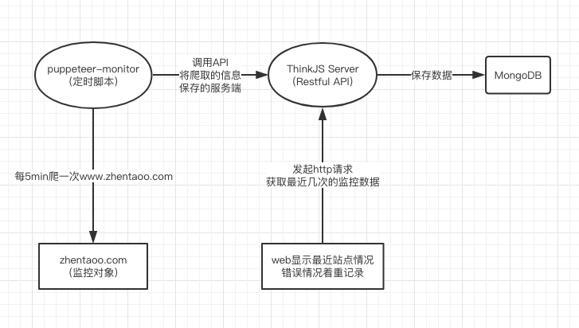
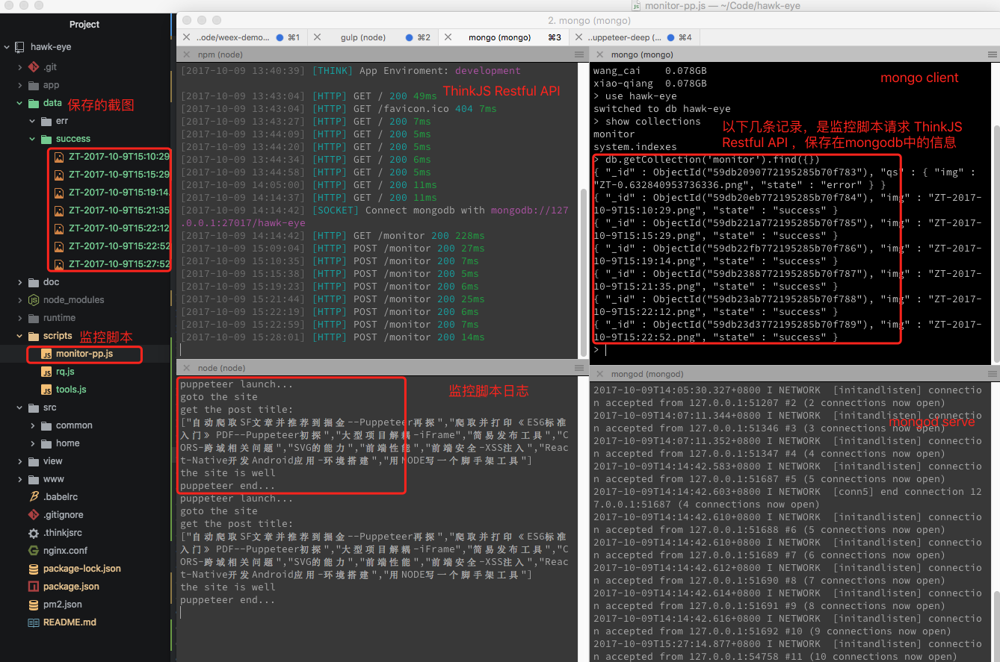
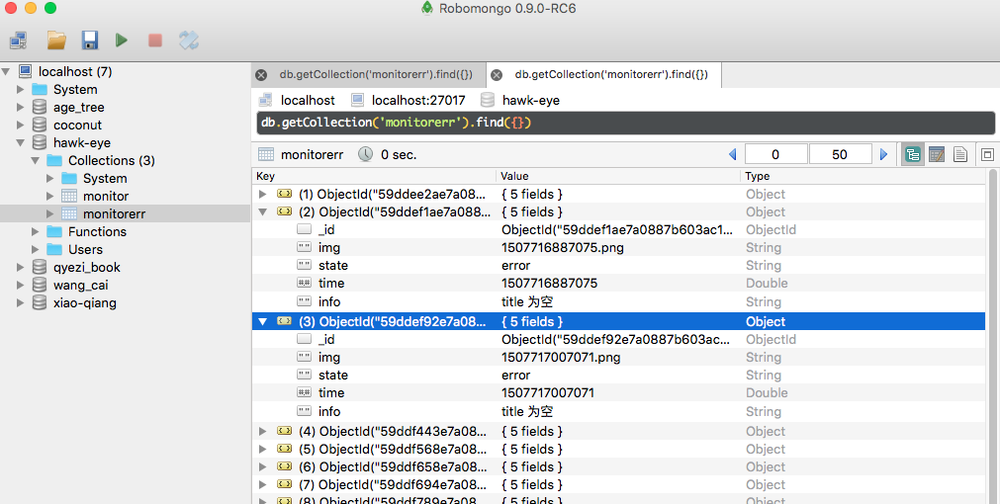
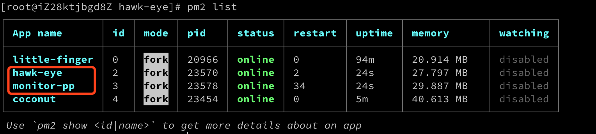
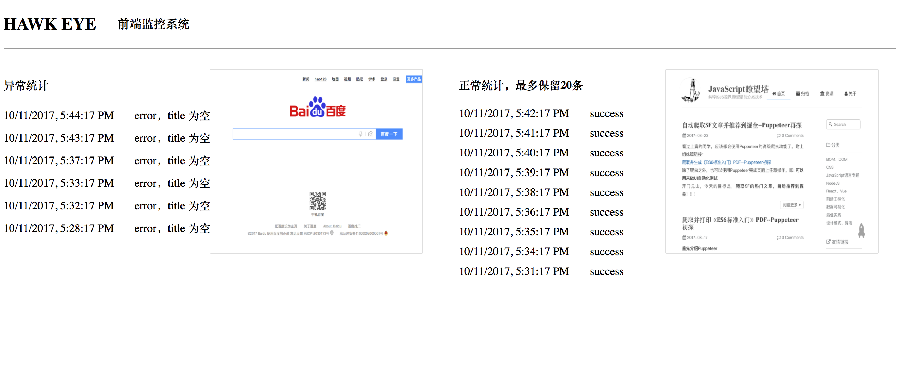

  **先谈谈前端监控的现状**
  目前市面上的前端监控系统，多是记录资源加载时长、系统抛错、统计埋点、UV/PV...
  对开发人员来说就是嵌入监控js脚本，监控的前提是：**该监控脚本能正常加载并执行**
  那么问题就来了，**假如某个站点CDN、DNS出现异常，监控脚本完全没机会加载（更不用说运行了）**
  站点Owner可能很长时间都不知道自己的网站挂了？！监控服务形同虚设...

  本文提到的监控改良，便是为解决此痛点

### 改良思路
**Q:** 假如站点DNS出现问题，请求根本打不到站点，监控脚本无法加载，要怎么应对这种情况呢？
~~A: 人肉运维啊，找个人每天盯着，5分钟刷下页面，看网站正不正常，不就行了嘛！~~
**A:** 咳，基本思路其实就是这样，不过把人肉运维改成Puppeteer，做个定时任务，每5分钟去跑一下监控站点，如果发现站点白屏则马上警报（短信通知），可以算是监控的最终兜底策略

**系统具体设计思路，代码：https://github.com/zhentaoo/hawk-eye**

### 项目分析
**开发时截图（Atom默认主题＋ZSH）**

**1. 定时脚本  [/hawk-eye/scripts/monitor-pp.js](https://github.com/zhentaoo/hawk-eye/blob/master/scripts/monitor-pp.js)**
- 该脚本每5分钟，访问一次zhentaoo.com，稍作等待后，观察其是否渲染正常
- 如果正常: 删除上次的正常图片，保存此次的图片，然后请求 monitor 接口
- 如果异常: 删除上次的异常图片，保存此次的图片，然后请求 monitorerr 接口
- 这里很难出现异常情况，于是我在每次脚本启动时，random了一个值，如果大于 > 0.7 则认为异常

**2. Restful API**
这里为了简单，我直接用了ThinkJS框架生成Restful API，大家有兴趣也可以看下使用方法，简单易上手
- 文档： https://thinkjs.org/zh-cn/doc/3.0/rest.html#toc-b15
- 安装2.0脚手架：`npm install -g thinkjs@2`
- 初始化项目：`thinkjs new hawk-eye`
- 创建restful api：`thinkjs controller home/monitor -r`
- 创建restful api：`thinkjs controller home/monitorerr -r`

**3. MongoDB**
这里就不进行mongodb的安装教学了，如果不习惯命令行的同学，推荐使用robomongo客户端

**4.项目线上部署图，PM2做为Node进程的管理工具**

**5.项目运行效果，监控对象行为记录**

### 后话
  关于Puppeteer，也已经研究、试水了一段时间，多数应用场景也都有考虑，并在github上写了些不成熟的项目和思路
  接下来我可能会试水其他东西，或者用它搞点事
  希望各位看官可以结合自己的需求／业务场景，充分挖掘Puppeteer功能
  有兴趣的话加群讨论，😄
