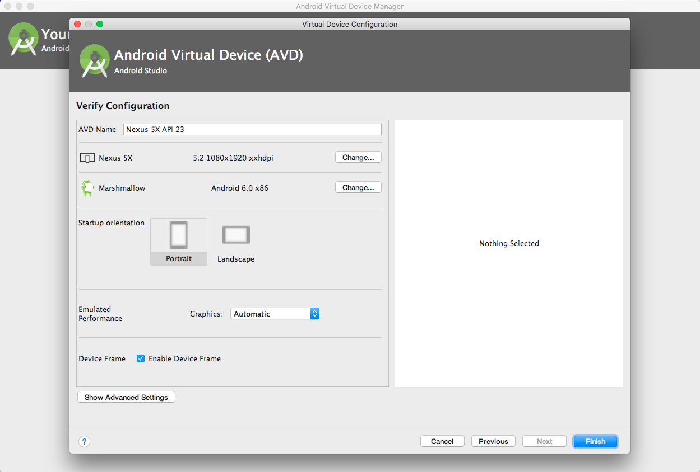
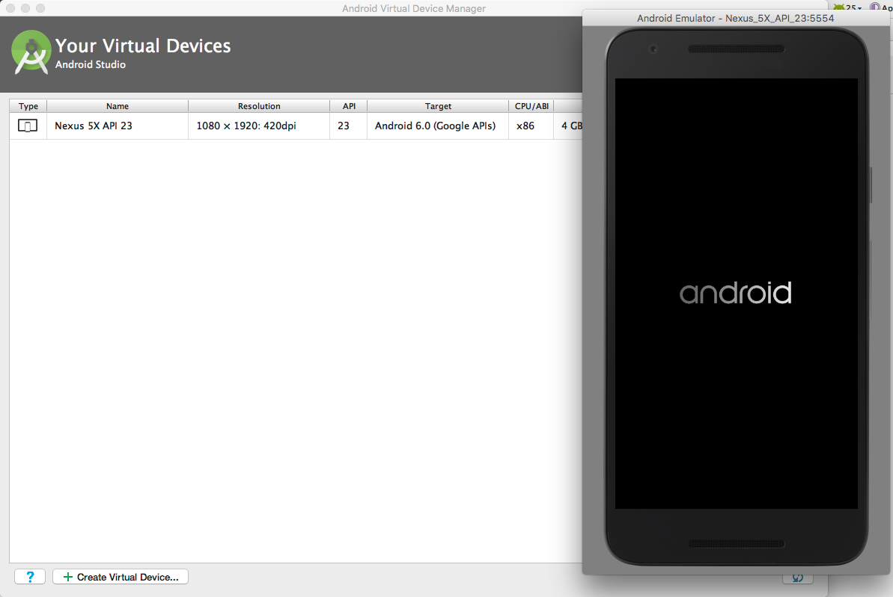
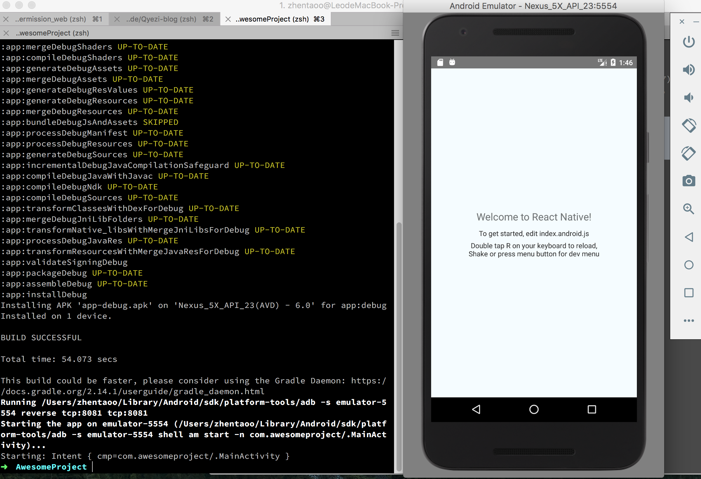
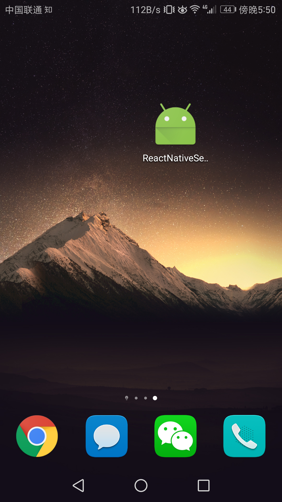
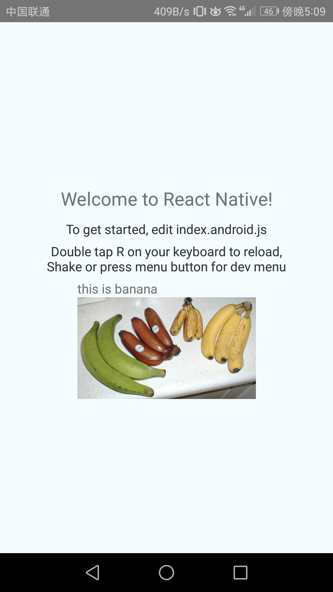
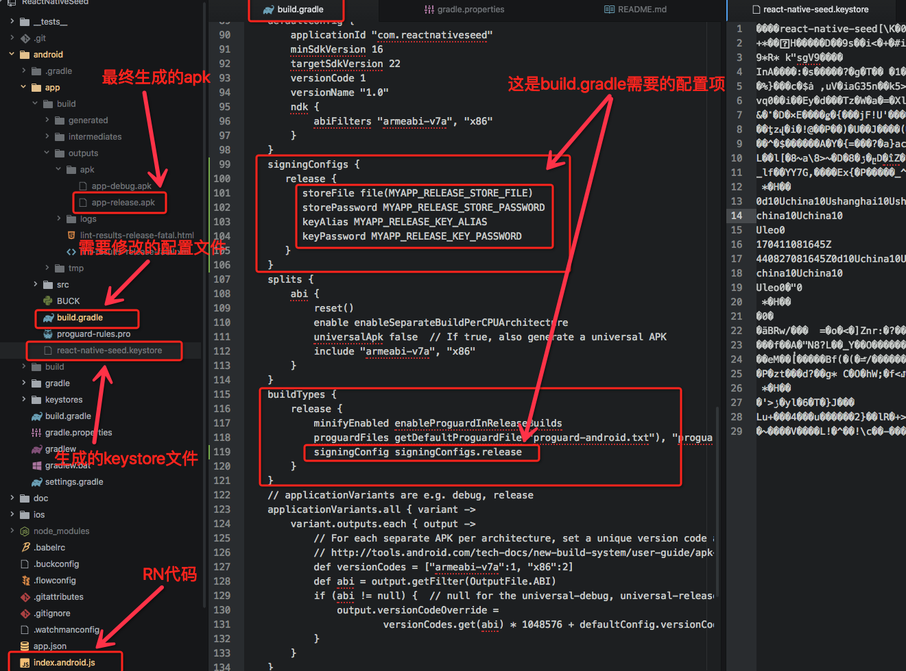

JS的跨“端”能力让人瞩目，从Browser到Server、Android、IOS甚至Unity、单片机
如果你是个多“端”爱好者，那么现在就开始学习使用React-Native 开发android应用吧.
学习第一步：android环境搭建，React-Native使用（后续会陆续更新）
感兴趣、有经验、有问题的同学都可以加群讨论....
参考文档: https://reactnative.cn/docs/0.43/getting-started.html
项目源码: https://github.com/zhentaoo/ReactNativeSeed

#### 安装 node，npm
```
➜  ~ node --version
v6.10.2
➜  ~ npm -version
3.10.10
```
#### 安装 Yarn、React Native的命令行工具（react-native-cli）
```
  npm install -g yarn react-native-cli
```

#### 安装 JAVA
```
➜  ~ java -version
java version "1.8.0_60"
Java(TM) SE Runtime Environment (build 1.8.0_60-b27)
Java HotSpot(TM) 64-Bit Server VM (build 25.60-b23, mixed mode)
```

#### 安装Android Studio，安装AVD


#### 运行AVD


#### 进入项目AwesomeProject， 运行 react-native run-android
```
➜  AwesomeProject react-native run-android
Scanning 560 folders for symlinks in /Users/zhentaoo/Code/AwesomeProject/node_modules (10ms)
Starting JS server...

.........
.........
.........

BUILD SUCCESSFUL

Total time: 54.073 secs

This build could be faster, please consider using the Gradle Daemon: https://docs.gradle.org/2.14.1/userguide/gradle_daemon.html
Running /Users/zhentaoo/Library/Android/sdk/platform-tools/adb -s emulator-5554 reverse tcp:8081 tcp:8081
Starting the app on emulator-5554 (/Users/zhentaoo/Library/Android/sdk/platform-tools/adb -s emulator-5554 shell am start -n com.awesomeproject/.MainActivity)...
Starting: Intent { cmp=com.awesomeproject/.MainActivity }
```
#### RN在AVD运行效果,react-native，hello-world项目搭建完成


### 打包流程
参考文档：https://reactnative.cn/docs/0.43/signed-apk-android.html#content

#### 生成签名密钥
  `$ keytool -genkey -v -keystore my-release-key.keystore -alias my-key-alias -keyalg RSA -keysize 2048 -validity 10000`

#### 设置gradle变量
  1. 把my-release-key.keystore文件放到你工程中的android/app文件夹下。
  2. 编辑~/.gradle/gradle.properties（没有就创建），添加如下的代码（把其中的****替换为相应密码）
  注意：~表示用户目录，比如windows上可能是C:\Users\用户名，而mac上可能是/Users/用户名。
  ```
  MYAPP_RELEASE_STORE_FILE=my-release-key.keystore
  MYAPP_RELEASE_KEY_ALIAS=my-key-alias
  MYAPP_RELEASE_STORE_PASSWORD=*****
  MYAPP_RELEASE_KEY_PASSWORD=*****
  ```
#### 添加签名到项目的gradle配置文件
  编辑你项目目录下的android/app/build.gradle，添加如下的签名配置：
  ```
  ...
  android {
      ...
      defaultConfig { ... }
      signingConfigs {
          release {
              storeFile file(MYAPP_RELEASE_STORE_FILE)
              storePassword MYAPP_RELEASE_STORE_PASSWORD
              keyAlias MYAPP_RELEASE_KEY_ALIAS
              keyPassword MYAPP_RELEASE_KEY_PASSWORD
          }
      }
      buildTypes {
          release {
              ...
              signingConfig signingConfigs.release
          }
      }
  }
  ...
  ```
#### 生成发行APK包
`$ cd android && ./gradlew assembleRelease`

#### 安装APK后最终效果
| 
#### 截图说明

