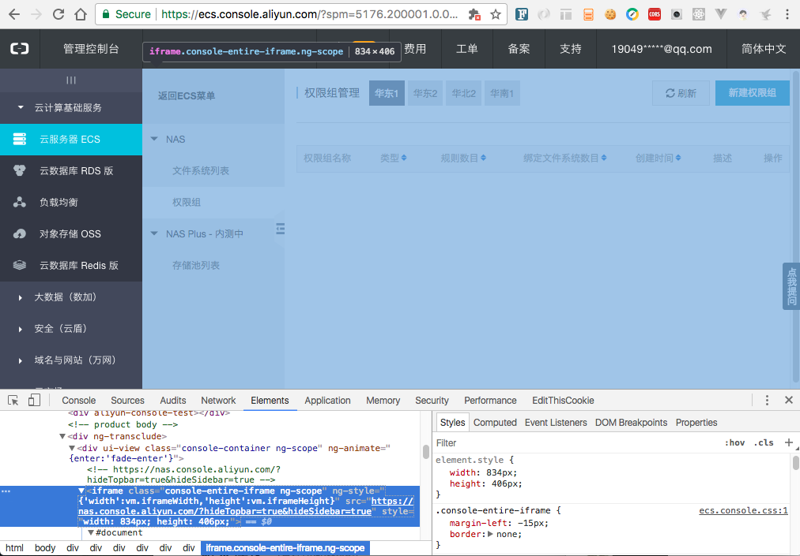
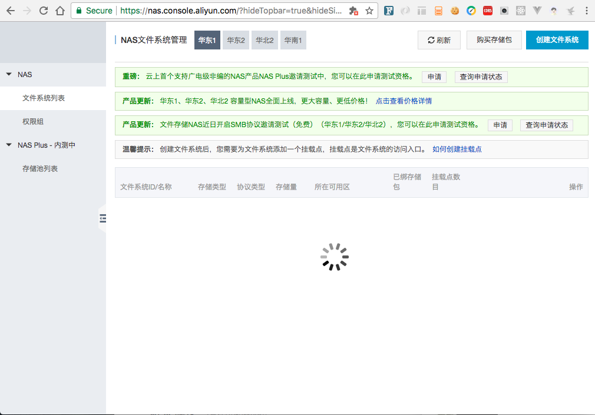

<!-- ---
title: 大型项目解耦-iFrame
categories: 前端工程化
---

对于软件设计来说，核心莫过于解耦、聚合，今天就来说说前端系统的解耦方案。

现在的前端使用Vue、React，这类组件化框架，开发人员可以轻易将不同业务逻辑分散在各个组件内，大大降低了耦合度提高了。多人合作的时候（10人以下），很容易维护一个中型项目。即便后期项目体积过大，使用code spliting等方案去做按需加载也不是什么大问题。

#### 但是，假如项目超过15人，多条业务线并行开发时，问题就会出现：
1. 项目频繁发布，任一次发布出现问题都可能导致其他业务线不可用，系统稳定性无法保障
2. 组员间并行开发，任一人引入新的类库（或升级版本），都可能导致其他人的代码不可用
3. Repo会越来越大，即使是项目主负责人也不一定能理清多条业务线的逻辑，code review形同虚设

---

所以有必要把一个系统中的子模块彻底抽离出来，**阿里云团队**可能遇到这类问题，于是采取了iframe的方案，可以看到阿里云的解决方案如下，**“云服务器ECS”其实是一个完全独立的子项目，嵌入在“阿里云控制台”项目中**

---


---

这个方案可能会**引来吐槽**，然而却是多业务线、多人并行开发场景下的最优解决方案(如果你有其他更好的方案请立即联系我)

使用这个方案的外壳（阿里云控制台）和子项目（服务器ECS），其实也面临着诸多问题，好在现代浏览器提供了**postmessage**可以轻松的实现iframe之间的通信

推广一下，个人写了一个该场景下，父子iframe通信的sdk（对postmessage的封装）
https://github.com/zhentaoo/post-message

```js
let pm = new PostMessage()

// 定制化的事件监听
pm.on('custom', function (data) {
  console.log(data);
})

// 默认向上发射事件，也可以定制发射的url（可选：window href）
pm.emit('ping', Math.random());

// 向下广播事件
pm.broadcast('ping', Math.random());
```

这样诸多通用请求可以在父项目中完成，再通过postmessage传递给子项目，方便的实现通信 -->
