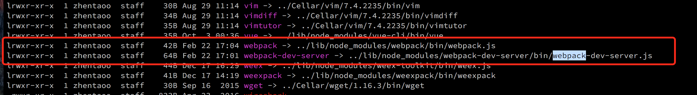
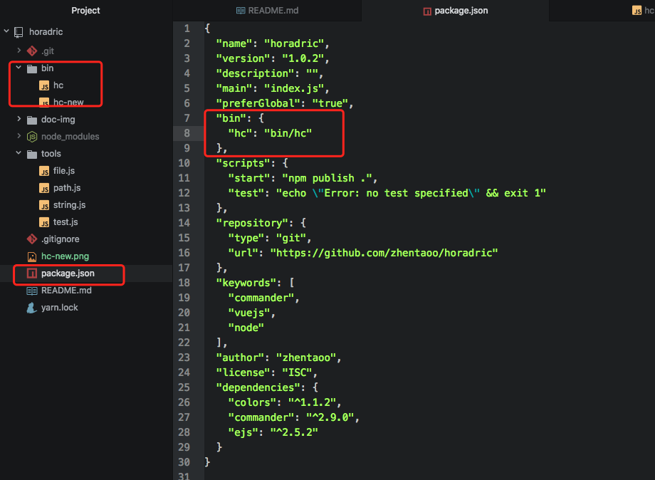
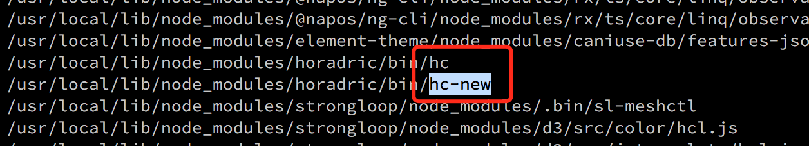

首先抛出一个问题，大家在使用webpack，webpack-dev-server，babel-cli，vue-cli，npm这类工具的时候有没有思考过一个问题？为什么我全局安装这个模块之后，就能在shell中使用webpack，babel这些命令？

#### 解答：之所以能使用webpack这些命令，意味着我在npm install webpack -g时，有个可执行文件添加到了我的环境变量中,如下图：

于是我在shell中敲击webpack命令，系统就会在环境变量中查找webpack，然后执行link file指向的webpack bin目录下的webpack.js 文件。接着就可以顺利的执行webpack相关的功能，编译打包静态文件........

那么让我们开始用node写一个CLI工具！！！
#### 第一步：首先要学会发布一个npm包
  - 很简单，到npmjs注册一个账号，注册好之后，到你的项目下
  - 执行 `npm login`，按提示操作即可
  - 接着 `npm publish`，进入你想要发布的包下，执行该命令即可
  - 不出意外，就成功发布了一个npm包

#### 第二步：那么如何全局安装这个包的时候，将可执行文件注册到环境变量？
重点就是，package.json，**bin配置可以将开发者希望执行的脚本注册到环境变量**，顺便把我的脚手架的项目结构po出来，源码： https://github.com/zhentaoo/horadric

在执行 `npm install -g horadric`之后，就能在环境变量中找到link file hc
如图：

此时当我在shell中敲击hc的时候，就会执行对应的hc文件，于是就有了接下来的一系列操作.

#### 第三步：需要注意的问题
  在写脚手架工具中，容易混乱的一个问题就是路径，因为操作文件的过程中，你可能需要把CLI中的模版文件复制到当前项目中。因此就出现了2个路径
  分别是
  - **process.cwd()** 当前工作目录，也就是你的当前项目的路径。
  - **__dirname** 是执行的源文件的所在路径，也就是bin文件所在的path，也就是脚手架中的源文件路径。

#### 第四步：优化的点
  1. seed如果和CLI集成在一起，假如seed需要升级，那么CLI也不得不升级，所有使用方都不得不重新安装CLI。可以把两者拆开。
  2. CLI在new一个seed的时候，使用 git clone，但如果seed版本过多，seed的git仓库势必很大.使用git clone --depth 1，只clone最新版本会是个不错的方案.之后在rm -rf .git
